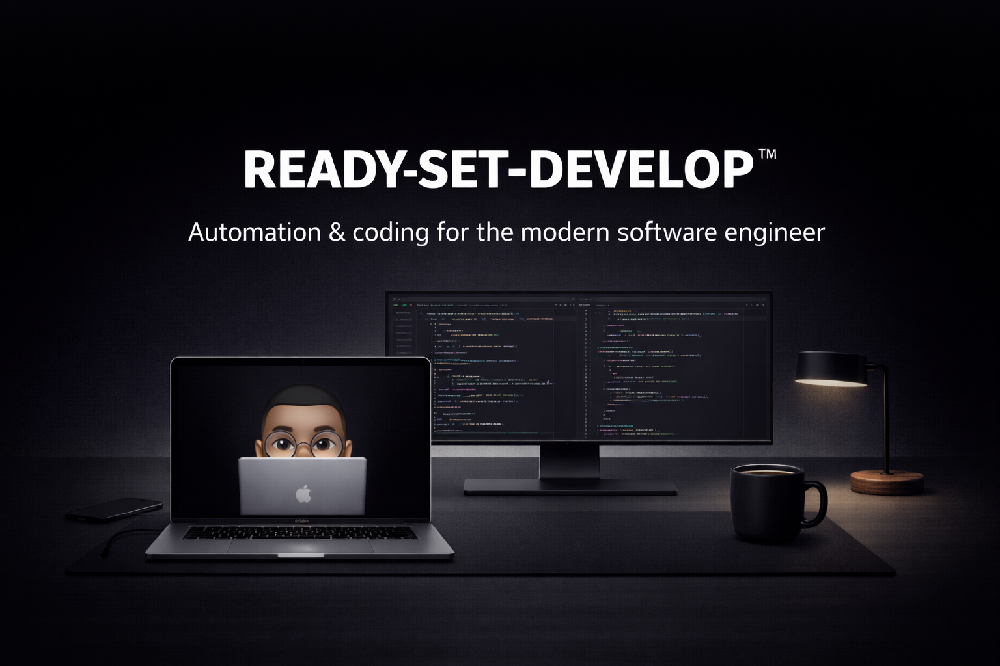

# Ready, Set, Develop

[](https://github.com/afonsoc12/ready-set-develop/actions/workflows/ci.yml)

**Ready, Set, Develop™** is an opinionated, reproducible workstation bootstrap system built with [Ansible](https://www.ansible.com/).



Automate setting up macOS development machines from scratch and keep configuration consistent across computers — including dotfiles, tooling, system preferences, and development environments.

---
## About

Over the years, I've set up enough machines to understand that **manual setup doesn't scale**. I treat computers as disposable tools: everything important is backed up, and the environment itself should be reproducible on demand.

This repository codifies workstation setup with version-controlled configuration and repeatable, idempotent automation. In case Murphy's Law pays a visit, get productive in **minutes**, not days!

---
## Features

### 💻 Workstation Provisioning
- **Homebrew** installation and package management (formulae & casks)
- **Mac App Store** applications
- **Python environment** (pyenv, uv, plugins, pip packages)
- **Git** configuration and repository cloning
- **Zsh** shell setup with Oh My Zsh
- **Editor / IDE / terminal** configuration
<<<<<<< HEAD
=======

### 📁 Dotfiles Management
Dotfiles are now **first-class citizens** of this project.

- 📂 XDG Base Directory compliant (where possible)
- 🏠 Minimal `$HOME` clutter
- 🔗 Deploy via symlink or copy
- ⚙️ Templated with Ansible
- 🔐 Secrets management via SOPS

**Pre-configured for:**
- zsh, Git, GnuPG, VS Code, rclone, rsync, k9s, and more

### 🎨 macOS Customization
- 🔧 System defaults
- 📌 Dock layout and ordering
- 💡 Developer-focused tweaks

---
## Getting Started

### Prerequisites

- macOS 12 or later (tested only on 26+)
- Approximately 30 minutes
- Internet connection
>>>>>>> a7efc97 (Add bootstrap script, license and updated readme)

### 📁 Dotfiles Management
Dotfiles are now **first-class citizens** of this project.

<<<<<<< HEAD
- 📂 XDG Base Directory compliant (where possible)
- 🏠 Minimal `$HOME` clutter
- 🔗 Deploy via symlink or copy
- ⚙️ Templated with Ansible
- 🔐 Secrets management via SOPS

**Pre-configured for:**
- zsh, Git, GnuPG, VS Code, rclone, rsync, k9s, and more

### 🎨 macOS Customization
- 🔧 System defaults
- 📌 Dock layout and ordering
- 💡 Developer-focused tweaks

---
## Getting Started

### Prerequisites

- macOS 12 or later (tested only on 26+)
- Approximately 30 minutes
- Internet connection

## Environment Variables

| Variable | Default | Description |
|----------|---------|-------------|
| `RSD_REPO_URL` | `https://github.com/afonsoc12/ready-set-develop.git` | Git URL of the repository to clone. |
| `RSD_REPO_DIR` | `$XDG_DATA_HOME/ready-set-develop` | Local path where the repository is cloned. |
| `RSD_REPO_VERSION` | master | Optional branch, tag, or commit hash to checkout after cloning. |
| `RSD_FORCE_REPO` | `false` | If `true`, removes existing repository before cloning and re-clones. |
| `SOPS_AGE_KEY_FILE` | _required_ | Path to your AGE key for decrypting SOPS secrets. Must exist before running the script. |
| `RSD_SOPS_FILE` | _none_ | Optional SOPS-encrypted configuration file inside the repository, passed to Ansible as `-e sops_file=<file>`. |
| `XDG_DATA_HOME` | `$HOME/.local/share` | Base directory for application data (XDG standard). |
| `RSD_ANSIBLE_HOME` | `$XDG_DATA_HOME/ansible` | Directory for Ansible runtime, roles, and collections. |
| `PATH` | `$HOME/Library/Python/3.9/bin:/opt/homebrew/bin:$PATH` | Ensures user Python and Homebrew binaries are available. |

## Installation Options

### ⚡ One-Command Bootstrap

This method is ideal if you want a **fully automated setup**. It will:

- Install XCode Command Line Tools
- Clone this repository to `~/.local/share/ready-set-develop` (XDG-compliant)
- Install Python packages and Ansible with system python
- Install Ansible Galaxy packages
- Run the full playbook

**Run:**

```bash
curl -sSL https://raw.githubusercontent.com/afonsoc12/ready-set-develop/main/bootstrap.sh | SOPS_AGE_KEY_FILE=<SOPS_AGE_KEY_FILE> zsh -s --

# With sops encrypted config
curl -sSL https://raw.githubusercontent.com/afonsoc12/ready-set-develop/main/bootstrap.sh | SOPS_AGE_KEY_FILE=<SOPS_AGE_KEY_FILE> zsh -s -- -e sops_file=<ENCRYPTED CONFIG>
```

### Step-by-step Installation

#### 1️⃣ Install Command Line Tools

```bash
xcode-select --install
```

Accept the license when prompted.

#### 2️⃣ Set Environment Variables

```bash
export PATH="$HOME/Library/Python/3.9/bin:/opt/homebrew/bin:$PATH"
export ANSIBLE_HOME="$HOME/.local/share/ansible"
```

#### 3️⃣ Install Ansible

```bash
/usr/bin/pip3 install --upgrade pip
/usr/bin/pip3 install ansible
```

#### 4️⃣ Clone Repository

```bash
git clone https://github.com/afonsoc12/ready-set-develop.git
cd ready-set-develop
```

#### 5️⃣ Install Ansible Requirements

```bash
ansible-galaxy install -r requirements.yml
```

#### 6️⃣ Run Playbook

```bash
export SOPS_AGE_KEY_FILE=<PATH AGE KEY FILE>
ansible-playbook main.yml --ask-become-pass

# If passing a sops encrypted vars
ansible-playbook main.yml -e sops_file=<PATH SOPS FILE> --ask-become-pass
```

---

=======
## Installation Options

### ⚡ One-Command Bootstrap

This method is ideal if you want a **fully automated setup**. It will:

- Install XCode Command Line Tools
- Clone this repository to `~/.local/share/ready-set-develop` (XDG-compliant)
- Install Python packages and Ansible with system python
- Install Ansible Galaxy packages
- Run the full playbook

**Run:**

```bash
curl -fsSL https://raw.githubusercontent.com/afonsoc12/ready-set-develop/main/bootstrap.zsh | SOPS_AGE_KEY_FILE=<PATH AGE KEY FILE> zsh -
```

### Step-by-step Installation

#### 1️⃣ Install Command Line Tools

```bash
xcode-select --install
```

Accept the license when prompted.

#### 2️⃣ Set Environment Variables

```bash
export PATH="$HOME/Library/Python/3.9/bin:/opt/homebrew/bin:$PATH"
export ANSIBLE_HOME="$HOME/.local/share/ansible"
```

#### 3️⃣ Install Ansible

```bash
/usr/bin/pip3 install --upgrade pip
/usr/bin/pip3 install ansible
```

#### 4️⃣ Clone Repository

```bash
git clone https://github.com/afonsoc12/ready-set-develop.git
cd ready-set-develop
```

#### 5️⃣ Install Ansible Requirements

```bash
ansible-galaxy install -r requirements.yml
```

#### 6️⃣ Run Playbook

```bash
export SOPS_AGE_KEY_FILE=<PATH AGE KEY FILE>
ansible-playbook main.yml --ask-become-pass

# If passing a sops encrypted vars
ansible-playbook main.yml -e sops_file=<PATH SOPS FILE> --ask-become-pass
```

---

>>>>>>> a7efc97 (Add bootstrap script, license and updated readme)
## Running

### Standard Execution

Run the full playbook:

```bash
ansible-playbook main.yml --ask-become-pass
```

### Custom Configuration

> TODO

Override default settings:

```bash
ansible-playbook main.yml -e @myconfig.yml --ask-become-pass
```

Or replace `config.yml` with your own configuration file.

---

## Development

### Prerequisites

- [uv](https://docs.astral.sh/uv/)

### Installation

#### 1️⃣ Setup development environment

This project uses [uv](https://docs.astral.sh/uv/) to manage Python dev dependencies and sync them.

```bash
uv sync --dev
pre-commit install
```

#### 2️⃣ Activate virtual environment

```bash
source .venv/bin/activate
```

#### 3️⃣ Linting & syntax checks

Before committing changes, run the following checks:

```bash
pre-commit run --all-files

# OR

yamllint .
ansible-lint .
ansible-playbook main.yml --syntax-check
```

---
## License

**Copyright © 2023–2026 [Afonso Costa](https://github.com/afonsoc12)**

Licensed under the Apache License 2.0. See the [LICENSE](./LICENSE) file for details.
